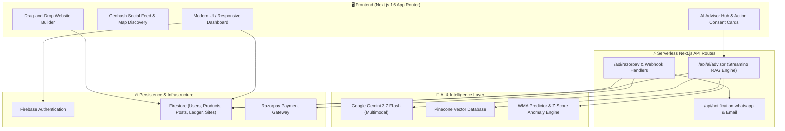

# 🏬 Thikana — The Hyperlocal Commerce & Autonomous AI Operating System

<div align="center">


**Empowering Local Merchants with Instant Multi-Tenant Storefronts, Geohash Discovery, No-Code Web Creation, and an Autonomous C-Suite AI Advisory Board.**

[](https://nextjs.org/)
[](https://react.dev/)
[](https://tailwindcss.com/)
[](https://ai.google.dev/)
[](https://www.pinecone.io/)
[](https://firebase.google.com/)
[](https://razorpay.com/)

[Key Features](#-key-features) • [AI C-Suite Advisory](#-autonomous-ai-c-suite-hub) • [Architecture](#-system-architecture) • [Tech Stack](#-technology-stack) • [Getting Started](#-getting-started) • [Project Structure](#-project-structure)

---

</div>

## 📌 Executive Summary

**Thikana** (*Hindi for "Destination" or "Address"*) is a next-generation hyperlocal social commerce platform and operating system built specifically for small & medium businesses (MSMEs). 

Traditional local merchants struggle with fragmented tools: expensive website builders, disconnected inventory systems, isolated payment gateways, and lack of expert guidance in finance, marketing, and operations. 

**Thikana unifies the entire retail lifecycle into one cohesive platform:**
1. **Interactive Geohash Discovery & Social Feed:** Hyperlocal spatial search and social commerce connecting neighborhoods directly to nearby stores.
2. **Visual No-Code Website Builder:** Drag-and-drop storefront creator with instant multi-tenant site publishing and AI-assisted page layout generation.
3. **Autonomous AI C-Suite Hub:** Real-time AI advisory board (CFO, Ops Manager, CMO, Support Lead) grounded in live store telemetry with 1-click actionable consent cards.
4. **Complete Merchant Hub:** Unified inventory management, service appointment scheduling, CRM call-lead tracking, and predictive sales analytics.
5. **Frictionless Commerce Pipeline:** Full cart, Razorpay payment processing, invoice generation, and automated WhatsApp/Email order notifications.

---

## 🚀 Key Features

### 1. 📍 Hyperlocal Discovery & Social Feed
- **Geohash Spatial Queries:** High-precision distance calculation and local merchant lookup via `ngeohash`.
- **Interactive Map Search:** Visual map-based exploration of local stores, service hubs, and trending neighborhood offers.
- **Dynamic Social Feed:** Local business posts, flash discounts, promotional campaigns, follow systems, and verified merchant badges.
- **Full Store Profiles:** Rich merchant landing pages showcasing active product catalogs, customer reviews, service menus, and direct contact options.

### 2. 🎨 Drag-and-Drop No-Code Website Builder
- **Visual Canvas:** Intuitive drag-and-drop interface powered by custom block registries (Hero, Features, Pricing, Maps, CTAs, Navbars, Footers).
- **AI Page Generator:** Instant storefront generation from simple business descriptions.
- **Multi-Tenant Site Hosting:** Dedicated sub-paths and custom URL routing (`/site/[websiteId]`) rendering merchant websites dynamically.
- **Responsive Layout Inspector:** Granular typography, spacing, color palettes, and component property controls in real-time.

### 3. 📦 Unified Inventory, Services & Merchant CRM
- **Real-Time Stock Auditing:** Low-stock threshold alerts (≤ 5 units), inventory turnover tracking, and catalog valuation.
- **Service Bookings & Slot Scheduling:** Buffer management and appointment booking for local service providers (salons, repairs, clinics).
- **Inquiry & Call-Lead CRM:** Structured lead tracking with response SLA monitoring (15-minute quick response target).

### 4. 💳 Payments, Cart & Automated Order Pipeline
- **Integrated Shopping Cart:** Seamless product selection and checkout flow across multiple stores.
- **Razorpay Checkout & Webhooks:** Secure end-to-end payment processing with real-time transaction verification.
- **Multichannel Notifications:** Automated order confirmations, receipts, and dispatch notifications delivered via **WhatsApp** and **Email**.

### 5. 📈 Predictive Financial Intelligence & Statistical Analytics
- **Weighted Moving Average (WMA):** Intelligent category budget and inventory expenditure forecasting.
- **Z-Score Anomaly Detection:** Real-time detection of spending spikes and financial irregularities ($Z > 2.0$).
- **Day-of-Week Spending Heatmaps:** Optimal promotional timing based on customer purchase patterns.

---

## 🤖 Autonomous AI C-Suite Hub

Small businesses rarely have the capital to hire dedicated executive teams. Thikana’s **AI Advisory Hub** equips every merchant with an always-on, data-grounded C-Suite.

```
                   ┌──────────────────────────────────────────────┐
                   │           Thikana AI Advisory Hub            │
                   └──────────────────────┬───────────────────────┘
                                          │
         ┌──────────────────┬─────────────┴───────┬──────────────────┐
         │                  │                     │                  │
         ▼                  ▼                     ▼                  ▼
  🏛️ Thikana CFO     📦 Thikana Ops        📢 Thikana CMO     🎧 Support Lead
  ─────────────────  ─────────────────    ─────────────────  ─────────────────
  • WMA Forecasting  • Low-Stock Alerts   • Viral Captions   • 15-min Lead SLA
  • Z-Score Anomaly  • Turnover Rates     • Promo Timing     • Callback Scripts
  • Tax/HSN Advisory • Catalog Restock    • Flash Campaigns  • Follow-up Flows
  • 1-Click Ledger   • 1-Click Catalog    • 1-Click Publish  • Customer Care
```

### ⚡ Grounded RAG & Actionable Consent Cards
Unlike generic chatbots, Thikana's AI Advisor:
1. **Pulls Live Store Context:** Dynamically injects the merchant's real-time inventory counts, transaction history, customer leads, and Pinecone vector knowledge into the Gemini prompt context.
2. **Generates Structured Action Proposals:** When an agent recommends a business action, it renders an interactive **Consent Card**:
   - **CFO:** `[PROPOSE_TRANSACTION]` → Merchants can approve and write expenses/income directly to the Firestore financial ledger with 1 click.
   - **Ops:** `[PROPOSE_INVENTORY_UPDATE]` → Merchants can approve stock quantity, price, or product additions instantly.
   - **CMO:** `[PROPOSE_POST]` → Merchants can review, edit, or publish social feed posts directly to their public profile with 1 click.
3. **Distributed Presence Locking:** Enforces single-occupant consultation locks per business persona via real-time heartbeat sync (`acquirePersonaLock`), preventing conflicting decisions across staff members.

---

## 🏗️ System Architecture



---

## 💻 Technology Stack

| Domain | Technology | Description |
| :--- | :--- | :--- |
| **Framework** | [Next.js 16 (App Router)](https://nextjs.org/) | Hybrid SSR, React Server Components, and Serverless API Routes |
| **UI & Core** | [React 19](https://react.dev/), [TypeScript](https://www.typescriptlang.org/) | Reactive component architecture and type-safe data structures |
| **Styling & Animations** | [Tailwind CSS v4](https://tailwindcss.com/), [Framer Motion](https://www.framer.com/motion), [Lenis](https://lenis.darkroom.engineering/) | Contemporary aesthetic, fluid micro-interactions, smooth scrolling |
| **Artificial Intelligence** | [Google Gemini 3.7 Flash](https://ai.google.dev/), [Pinecone](https://www.pinecone.io/) | Streaming multimodal generative reasoning and vector knowledge retrieval |
| **Database & Auth** | [Firebase Firestore](https://firebase.google.com/docs/firestore), [Firebase Auth](https://firebase.google.com/docs/auth) | Real-time multi-tenant document database, security rules, authentication |
| **Geospatial Engine** | [ngeohash](https://github.com/sunng87/node-geohash) | Geohashing spatial indexing for proximity store search |
| **Data Visualization** | [Recharts](https://recharts.org/) | Responsive business analytics, sales charts, and financial trends |
| **Payment Gateway** | [Razorpay](https://razorpay.com/) | Secure UPI, card, and net banking checkout with automated webhook verification |
| **State & Forms** | [Zustand](https://zustand-demo.pmnd.rs/), [React Hook Form](https://react-hook-form.com/), [Zod](https://zod.dev/) | Global state synchronization and robust schema validation |

---

## 📁 Project Structure

```text
thikana/
├── app/
│   ├── (auth)/                       # Authentication routes (Sign-in, Register, Onboarding)
│   ├── (dashboard)/                  # Merchant & User Workspace
│   │   ├── (with-recommendations)/   # Feed, Spatial Map, Store Profiles
│   │   │   ├── [username]/           # Dynamic Merchant Public Storefront
│   │   │   ├── feed/                 # Hyperlocal Neighborhood Social Feed
│   │   │   └── map/                  # Spatial Discovery & Store Locator
│   │   ├── business-dashboard/       # Consolidated Business Operations
│   │   ├── cart/                     # Universal Cart & Checkout
│   │   ├── products/                 # Product Catalog Management
│   │   ├── profile/
│   │   │   ├── ai-advisor/           # 🤖 Multi-Persona AI Advisory Hub
│   │   │   ├── analytics/            # 📈 Sales, CRM Leads & Valuation Metrics
│   │   │   ├── inventory/            # 📦 Live Stock & Restock Operations
│   │   │   └── services/             # 🛠️ Service Slots & Booking Engine
│   │   └── websites/                 # 🎨 No-Code Website Builder Canvas
│   ├── api/
│   │   ├── ai/advisor/               # Streaming Gemini RAG route
│   │   ├── notification-email/       # Automated Email Dispatch
│   │   ├── notification-whatsapp/    # Automated WhatsApp Alerts
│   │   ├── razorpay/                 # Razorpay Order Creation
│   │   └── razorpay-webhook/         # Webhook Payment Reconciliation
│   ├── site/[websiteId]/             # Dynamic Multi-Tenant Published Websites
│   ├── globals.css                   # Global Design System & Custom Tokens
│   ├── layout.jsx                    # Root Layout & Provider Registry
│   └── page.jsx                      # High-Impact Animated Landing Page
├── components/
│   ├── builder/                      # Visual Builder (Canvas, Sidebars, AI Generator, Toolbar)
│   ├── registry/                     # Pre-Built Blocks (Hero, Features, Pricing, Map, CTA)
│   ├── cart/                         # Cart Drawers & Checkout Modals
│   ├── dashboard/                    # Overview Cards & Metric Visualizers
│   ├── profile/                      # Store Profile & Setting Components
│   └── PostCard.jsx                  # Social Feed Cards with Engagement Handlers
├── lib/
│   ├── ai/
│   │   ├── personas.ts               # CFO, Ops, CMO, Support Agent Definitions & Prompts
│   │   ├── pinecone.js               # Vector DB Connection & Embeddings
│   │   └── rag-engine.ts             # Dynamic Live Merchant Context & Prompt Assembler
│   ├── analytics/
│   │   ├── anomalyDetector.ts        # Z-Score Expense Anomaly Detection
│   │   ├── expenseRecommender.ts     # Day-of-Week Spending Heatmaps & Cap Evals
│   │   └── spendingPredictor.ts      # Weighted Moving Average (WMA) Predictor
│   ├── firebase.js                   # Client Firebase SDK Configuration
│   ├── geohash.js                    # Geohash Radius & Coordinate Utilities
│   ├── personaLock.js                # Distributed Concurrency Lock Handlers
│   ├── templates.js                  # Storefront Starter Templates
│   └── website-operations.js         # Site Publishing & Block CRUD Operations
└── public/                           # Static Assets, Vectors, Icons & Branding
```

---

## 🛠️ Getting Started

### Prerequisites
- **Node.js**: v18.18.0 or higher
- **npm** / **yarn** / **pnpm** / **bun**
- A **Firebase Project** (with Authentication & Firestore enabled)
- A **Google Gemini API Key**
- A **Pinecone API Key & Index** (for vector RAG)
- A **Razorpay Account** (Key ID & Secret for payments)

### 1. Clone & Install Dependencies

```bash
# Clone the repository
git clone https://github.com/Prg-Yash/thikana.git

# Navigate to project directory
cd thikana

# Install project dependencies
npm install
```

### 2. Configure Environment Variables

Create a `.env.local` or `.env` file in the project root with the following keys:

```env
# ── Google Gemini AI ──────────────────────────────────
GEMINI_API_KEY=your_gemini_api_key_here

# ── Pinecone Vector Database ──────────────────────────
PINECONE_API_KEY=your_pinecone_api_key_here
PINECONE_INDEX_NAME=thikana-knowledge

# ── Firebase Client SDK ───────────────────────────────
NEXT_PUBLIC_FIREBASE_API_KEY=your_firebase_api_key
NEXT_PUBLIC_FIREBASE_AUTH_DOMAIN=your_project.firebaseapp.com
NEXT_PUBLIC_FIREBASE_PROJECT_ID=your_project_id
NEXT_PUBLIC_FIREBASE_STORAGE_BUCKET=your_project.appspot.com
NEXT_PUBLIC_FIREBASE_MESSAGING_SENDER_ID=your_sender_id
NEXT_PUBLIC_FIREBASE_APP_ID=your_app_id

# ── Razorpay Payment Gateway ──────────────────────────
NEXT_PUBLIC_RAZORPAY_KEY_ID=your_razorpay_key_id
RAZORPAY_KEY_SECRET=your_razorpay_key_secret
RAZORPAY_WEBHOOK_SECRET=your_webhook_secret

# ── Notification Integrations (Optional) ──────────────
RESEND_API_KEY=your_resend_api_key
WHATSAPP_API_TOKEN=your_whatsapp_token
```

### 3. Run Development Server

```bash
npm run dev
```

Open [http://localhost:3000](http://localhost:3000) in your browser to explore Thikana.

### 4. Build for Production

```bash
npm run build
npm run start
```

---

## 🔒 Security, Isolation & Multi-Tenancy

- **Strict Merchant Data Isolation:** AI advisors can only access server-validated telemetry for the authenticated merchant session. Competitor and cross-tenant data requests are strictly rejected at the prompt and data retrieval layer.
- **Action Verification:** No transactional or destructive operations (modifying inventory, adding ledger records, publishing posts) can occur autonomously without explicit merchant consent via **interactive consent cards**.
- **Real-Time Persona Concurrency:** Firestore-backed heartbeat locks prevent multi-user collisions and race conditions during live strategic consultations.

---

## 🏆 Built For BuildSprint Hackathon

Crafted with ❤️ by the **Thikana Team** to empower local businesses and revolutionize neighborhood commerce through high-impact artificial intelligence.
